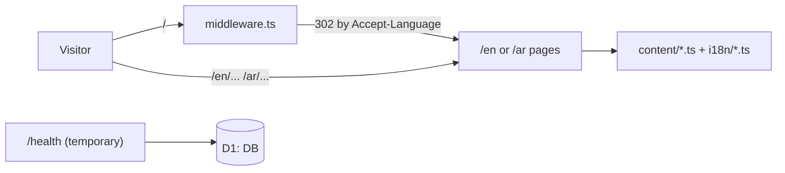

# Architecture

> Grows phase by phase. Covered so far: routing, i18n, styling and data (Phases 1–2).

## Overview

The site is a vinext (Next.js App Router API on Vite) app running as one Cloudflare Worker. Public pages are server components rendered from TypeScript content files; the only client JavaScript is the language toggle.

## Routing and i18n

| Path | What |
|---|---|
| `/` | `middleware.ts` redirects (302) to `/en` or `/ar` from `Accept-Language` (any `ar*` as the top preference → Arabic), keeping the query string, so `/?l=CODE` lands on `/ar?l=CODE`. The response varies by `Accept-Language` and is not cached. |
| `/{lang}` | Home |
| `/{lang}/roadmap` | Roadmap |
| `/{lang}/hackathons` | Hackathons |
| any other `/{lang}` | 404 (`dynamicParams = false`) |

- `app/[lang]/layout.tsx` is a **root layout**: it renders `<html lang dir>` per locale, so the whole page mirrors in Arabic. The temporary dev pages have their own root layout in `app/(dev)/layout.tsx`, and the admin will get its own in Phase 4.
- Locales, `dir`, `Accept-Language` parsing and path switching live in `lib/i18n.ts`.
- UI strings are in `i18n/en.ts` and `i18n/ar.ts`; `ar.ts` is typed against `en.ts`, so a missing key fails the type-check.
- `components/RichText.tsx` renders content text: backticks mark mono code names, and in Arabic every run of Latin text (ft_ssl, ESP32, 42) is wrapped in a left-to-right span so it doesn't reorder. Latin titles inside RTL cards use `<bdi>`.
- The language toggle (`components/LanguageToggle.tsx`, a client component) links to the same page in the other language and appends `?l=` from the current URL, so tracked-link attribution survives a language switch.

## Styling

- `app/styles/tokens.css`: the Calm Quantum design tokens as CSS variables (from the Claude Design system and canvas).
- `app/globals.css`: reset, focus ring, reduced-motion rules.
- `app/styles/site.css`: the public site. Mobile first (390px design); the desktop layout (1440px design) starts at 900px. Only logical properties (`margin-inline`, `inset-inline-start`, ...), so RTL needs almost no special rules; directional icons carry a `flip` class mirrored under `[dir="rtl"]`.
- Motion is CSS only: nebula drift, twinkling stars, particle pairs, waves, the in-progress pulse, and the journey rail drawing in on scroll (`animation-timeline: view()` inside `@supports`). `prefers-reduced-motion: reduce` stops all of it.

## Content and data

| File | Holds |
|---|---|
| `content/profile.ts` | Name, contact details, photo paths |
| `content/journey.ts` | The five journey stations (Home + Roadmap) |
| `content/roadmap.ts` | Zones, Next items, "last updated", topics being studied |
| `content/hackathons.ts` | Hackathons and their computed stats |
| `content/site.ts` | Feature switches (Projects hidden until Phase 7) |
| `db/schema.ts` | D1 tables for tracked links and events (used from Phase 3) |

How to edit these is in `docs/content.md`.

## LinkedIn posts

Hackathon posts are not embedded. "View post" in `components/HackathonCard.tsx` is a plain link that opens the post on LinkedIn in a new tab, so the page loads nothing from LinkedIn and needs no third-party frames in its CSP.

## Cloudflare bindings

| Binding | Used by |
|---|---|
| `DB` (D1) | `/health` now; link tracking (Phase 3) and auth (Phase 4) |
| `MEDIA` (R2) | Reserved for project images (Phase 7) |
| `ASSETS` | Static files from `public/` (the portrait) and the build |

Bindings are read with `import { env } from "cloudflare:workers"`; `db/client.ts` creates the Drizzle client per request.
